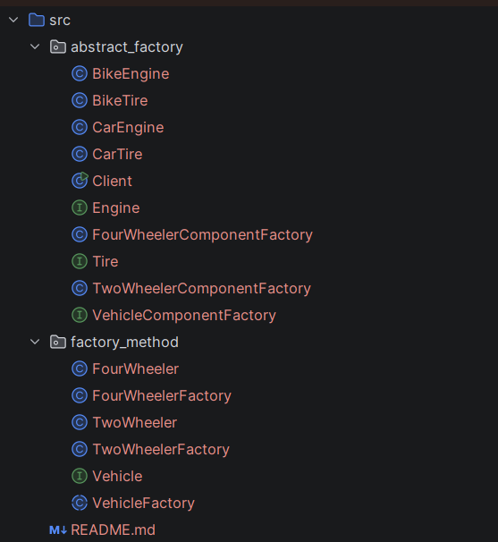

# Vehicle Factory Implementation (Assignment 2)
A java implementation demonstrating the Factory Method and Abstract Factory design patterns, developed for the theme of Vehicles(Option B).

## Project Overview
- **Part 1 (Factory method)**: Manages single vehicle creation(`TwoWheeler`,`FourWheeler`) by delegating instantiation to dedicated creator subclasses.
- **Part 2 (Abstract Factory)**: Manages consistent families of vehicle components (`Engine`, `Tire`) to ensure valid configurations without coupling client code to concrete classes.

## Project Structure
In the following image the structure of the project can be seen:

## How to run
1. Open the project in your preferred IDE (IntelliJ IDEA, VS Code, or Eclipse).

2. Compile all `.java` files under `src/main/java/com/vehicle/`.

3. Run the `main` method located in `com.vehicle.abstract_factory.Client.java` to view the output for both pattern implementations.